<h1>X-Versity</h1>
<h1 align="center"></h1>

 <a href="https://x-versity.herokuapp.com">Live website</a>

  <a href="https://github.com/DADEVFA/x-versity">GitHub Repository</a>

## About

X-versity, a simple online educational platform.

## Table of contents: 
* [General](#general)
* [Technologies](#technologies)
* [Database](#database)
* [UX](#ux)
* [Design](#design)
* [Testing](#testing)
* [Deployment](#deployment)
* [Credits](#credits)

# General
A very simple educational app with an open layout. Schools could use this as their main platform for distance courses or as a backup in case one student need to study from distance, and or submit their work from there. The platform could expand and grow with complex functionality in the future, but for now, it's just very lightweight. Design is minimalistic and simple, to not take to much focus off whats important. 

# Technologies

## Languages: 

* HTML5
* CSS3
* Javascript
* Python 3

## Programs, Frameworks, APIs & Libraries:

* Adobe Xd - Create Wireframe & design the website.
* Adobe Photoshop - Crop image & logo. 
* Git - Version Control & track changes in code.
* GitHub - Host all code files. 
* Gitpod - Code enviroment, allows code to pe pushed to Github.
* Google Fonts - Fonts.
* MongoDB - Database. Holds all the data.  
* Heroku - Used for deploying the app.
* Materialize - For layout, functions and base design. 
* jQuery - Used for navigation bar and to make app interactive. 
* Font Awesome - Complements the design. 
* Cloudinary - For storing uploaded files. 


# UX - User Experience

## As a confirmed student with a course: 

1. I want to be able to start studying right away.

2. I want to understand the layout and reason for the sites functions without having to focus too much.

3. I want to be able to understand what the teacher wants me to do. 

## As a Teacher: 

1. I want to be able to set up my course in an easy way.

2. I want to see how my students are doing. 

3. I would like to grade my students submitted assignments.

## As Admin: 

1. I want to be able to add more courses. 

2. I want to be able to grant my users access. 

# Design 


### Fonts: 

For most text:
```
* Main font: Titillium Web

* Fallback font: Sans-Serif
```

For Navigation text:
```
* Navigation font: Lato

* Fallback font: Sans-Serif
```

### Colors: 
<h1 align="center">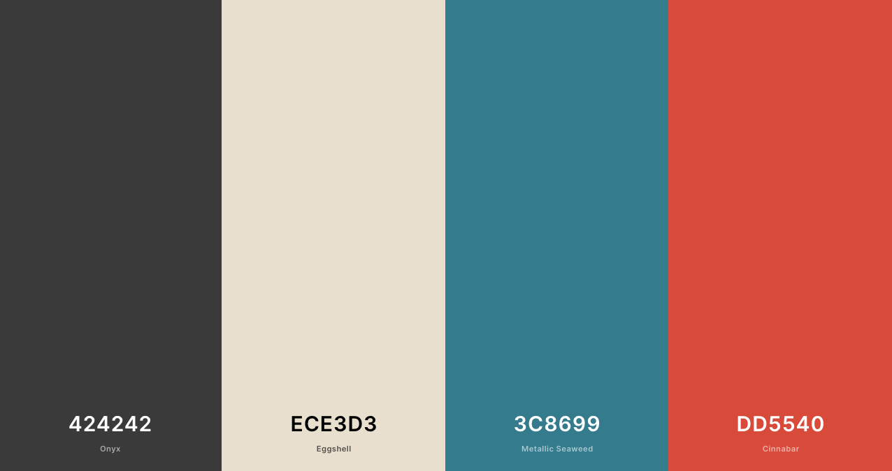</h1>

## User Types
* Admin (could be X-Versity / school / company)
* Students 
* Teachers

# Database Schema

## MongoDB database structure:

- users
  - _id
  - username
  - email
  - password
  - role
  - assigned_course
  - enrollment_day
  - status
  - apply_course
  - created_by
  - created_date
  - updated_by
  - updated_date

  ---
- submissions
  - _id
  - text_submission
  - file_submission
  - student
  - course_name
  - date
  - grade
  - feedback

  ---
- lessons
  - _id
  - course_name
  - course_module
  - lesson_title
  - lesson_nr
  - lesson_description
  - due_date
  - is_mandatory
  - has_audio
  - lesson_audio
  - has_video
  - lesson_video
  - has_submission
  - lesson_test
  - text_answer
  - file_answer
  - created_by
  ---
- courses
  - _id
  - course_name
  ---

 # Pages:

* ## Home:
Hompage was not really needed for this application, but there is a simple one implemented. Nice typewriter effect function, throwing out diffrent slogans. Aim to set the "study mood" of the user to peak level. 
The action button will take visitor to register or to profile, depending on the user. 

* ## Registration / Login:
Email address is the only thing we look to see if it's not already taken. We only ask for passwords once. As a user I find it annoying and rude to tell someone to repeat themselves. In the end, most users will still reset their password minimum once every year. 

* ## Profile:
The Profile indicates if a course is assigned or not. For the diffrent users the action button will be diffrent. Students go to the lessons, teachers to the student submits and the ones without any courses will be asked to logout as they get to know that they will receive an activation letter. ( Something that happens outside the platform, for now ). 

* ## My lessons:
The heart of the platform. This is the classroom. It will be filled with the course that any student has been assigned to by the admin. The diffrent lessons can contain audio or video, and some short text. Assignments will also be visible if choosen by teacher. Students can upload pdf, images and text, all depending on how the teacher set it up. Design is simple but with a soft dark blue background, to lower stress. 

* ## Add lessons:
This is where teachers create their lessons and their course. They descripe the lesson, give it a title and let's student know if it's mandatory, or what the assignment is, how the student should submit their work and more. 

* ## Edit lessons:
This is where the teacher can edit the lesson, they need to visit "my lessons" first to see the lessons and pick which one they want to edit. Delete the lesson is also a possibility from here. 

* ## Submissions:
This is where the teacher can see all the latest submissions in their course. Teacher can see the status of each submission here, and if they press "Grade" button and they enter the "grade submissions" page. And Check or Grade button will be displayed depending on the status.

* ## Grade Submissions:
This is where the teacher can see the students submission. If it is a file, then the pdf or image will be displayed in a new tab. For a text submission teacher will be able to read it all from here. Grade it and leave feadback. 

* ## Users:
This is where the admin can see all users with the latest to the top. With their current status displayed clearly, admin can activly set and assign new courses once they've pressed "manage", which will take them to Edit User".

* ## Edit Users:
Here is where admin updates the user. Set the courses, sets the roles and updates the status of the students or teachers. 

* ## Add Course:
Here is where admin creates a new course. So that it could be assigned to users, and so that users can apply for them when registering. 

* ## Footer:
A very simple footer, that mimicks the navigation bar / side nav, with the diffrent set limitations depending on the user roles. Socials added also. Not sure if they should be there, cause users might feel the need to go there, and ends up not studying or registering and so on. They are there to fill out the empty space.  

* ## Overall:
Functionality is still very limited and could be further developed. 


## Future features: 
* Filter functionality for both Teachers and Admin, for when the users count grows. 
* Custom Error handlers. 
* Students get to see their grades. 
* Students and teachers communicate, through messages / zoom. 
* Parents can view their childrens performances, and results by logging in. 
* Users can have more than one active course. 
* Moduls devide up the lessons in one course. 
* Due date could be displayed in many ways, counting down, warning the student when it's getting close to deadline. 
* Teachers can add more texts based lessons, quizes, tests on time, one try limit for students could be added. 
* Completed lessons would be grayed out for students. 
* Users get to reset their passwords through email. 


# Testing 

## Final Tests on live version: 

### Navigation Bar/Menu: 
1. Works on all devices as expected. (Good)
2. Correct links are visable for the diffrent users. (Good)

### Home: 
3. Looks good on almost all devices but works as expected. (Good)
4. The action button works as expected depending on user is in session or not. (Good)
5. Landscape on iPhone 5s does not look good. (Improve)

### Register: 
6. Looks good on almost all devices. Laptops are not quite symmetrical. (Improve) 
7. Apply for course is not dynamically grabbing whats in the database. (Improve)

### Footer:
8. No issues here. Works everywhere on all browsers. (Good)

### Profile: 
9. Looks good on all devices exept iphone 5s when it comes to the action button. (Improve)
10. Diffrent user gets diffrent buttons. 

### Add Lesson: 
11. The default select dropdown button is still visible on Safari. (Improve)
12. Everything else works as it should. (Good)
13. If has audio or has video is clicked on the label, it activates the applied JS code doesn't however. (Improve)
14. Looks good on all devices.  (Good)

### My lessons: 
15. Looks good on all devices, all browsers. (Good)
16. Issues regarding third party cookies appear in the console for the embedded preview from Youtube or Soundcloud depending on lessons layout. (Improve)
17. Student can play media, read things and submit their work. PDFs and images work. (Good)
18. All embedds work. They could however look better. (Improve)
19. Text input doesn't activates with delay, or after several tries. (Improve)
20. Video on Ipad needs more space underneath. 

### Edit Lesson: 
21. Button available if user is a teacher, has the course that is assigned, and was the creator of the lesson. (Good)
22. Update works fine (Good)
23. Layout looks ok, defualt select is still viseble on iPhones on Safari. (Improve)
24. Has Audio or Has Video switches has two issues. If the label is pressed, then the switch activates (1). But not the custom styles that is implemented and should be switched on and off with JS. (2) If the opposite media switch is on, and user edits by only pressing the other alternative, which is possible in "edit lesson", but not in "add lesson" that activates the new one, and the first one gets unactivated, and the box dissapears correctly. However if teacher wants to go back on his first alternative by switching off the new option, and re-activates the other or same, the JS will not activate, even if switch is active. Should be bullet proof, even though the possibility of this bug to appear is not so big. (Improve)

### Submissions: 
25. Works as expected. Displays everything as it should. (Good)
26. Button changes as should. Grade or Check. (Good)
27. Submission ID is not as it should be, almost outside the frame. (Improve)
28. Layout on Landscape for mobiles is pressed to the left. (Improve)

### Grade Submissions: 
29. Works as expected. Teacher sets grades based on the submission material. Which displays perfectly. (Good)
30. Teacher updates the submission from empty, so it's possible to edit it by pressing check. A teacher rarely updates a grade or feedback. But it's still possible. (Good)

### Manage Courses: 
31. Looks good and works on all devices.
32. Admin can edit or add a new course from here. Pressing edit takes admin to edit template (Good)

### Edit Course: 
33. Admin can edit course name. (Good)
34. Delete doesn-t work (Improve)
35. Looks good and works on all devices.

### Manage Users:
36. Looks good and works on all devices. 
37. Search function or filter functionality should be added. Even if the latest users are displayed first, and they need to be enrolled accordingly. (Improve)
38 Everything displays as should. 

### Edit User: 
38. Looks good on all devices. (Good)
39. However upper buttons and user id should be sent to the left for alignment. (Improve)
40. Works as expected. (Good)

  ---

### Physical Test Devices:
* iPhone 5 SE 
* iPhone 7 
* iPhone X 
* Samsung S10
* Macbook Pro 13
* iPad

### Chrome Devtools Test Devices:
* All iPhones
* Samsung Galaxy s5
* Moto G4
* Pixel 2 and 2XL
* Surface Duo 
* Ipad & Ipad Pro
* Macbook Pro 13
* Responsive mode

### Test Browsers:
* Chrome
* Safari 
* Firefox 
* Opera 

### CSS Validation Results
- CSS - Pass.

### JSHint Check: 
- Few warnings, no errors. 

### PEP8 Check: 
- All right. 

## Bugs (Known Issues): 
1. Admin updates user, password updates. EVEN if password hasnt been touched. (FIXED) 
2. If Teacher edits lesson, and presses the one switch that is off between file or text submissions. It will work, however if teacher does click again, it will be switching on or off in a slightly confusing way. However no issue if teacher switches off first, then on for the other one. This is only in edit. 
3.  If teacher presses on the label at the file or text submission switches, it can get turned on / off. 
4. Hide default select input on Safari. (FIXED)  
5. Register frame: laptops are not quite symmetrical. (FIXED) 
6. On hompage in Landscape on iPhone 5s does not look as it should.
7. Home page in macbook 13 inch does not behave as it should. 
8. Scrollspy on "my lessons" gets activated slightly to soon. 


# User Story Testing

### 1. As a new student with assigned course:
```
1. I want to be able to start studying right away.
2. I want to understand the layout and reason for the sites functions without having to focus too much.
3. I want to be able to understand what the teacher wants me to do. 
```
### Result: 

1) When student logs in, profile will be displayed. Clicking on the call to action button takes student to my lessons
<h1 align="center">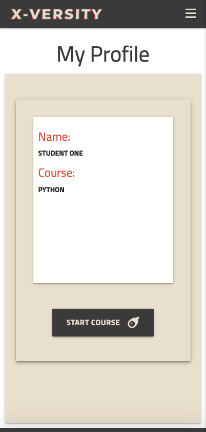</h1>

2) Lesson number, title, description and what kind of lesson it is. Easy to figure out. Scrollspy to the right to let student know progress or to jump between them.  
<h1 align="center">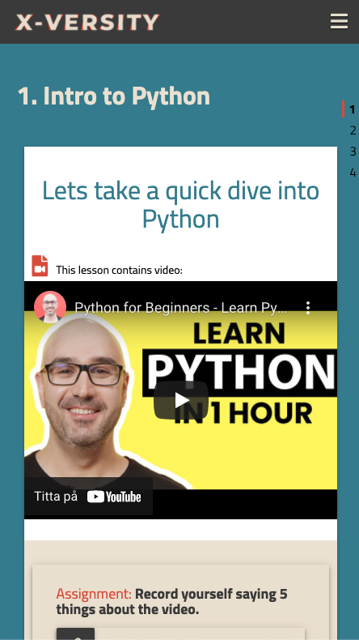</h1>

3) Assignment is highlighted, student submits with text in this example.
<h1 align="center">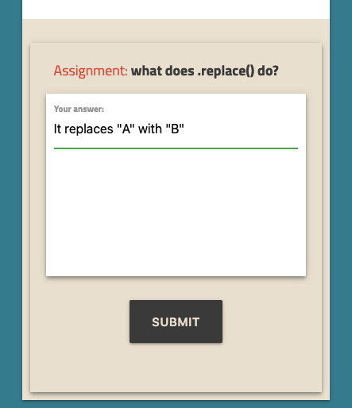</h1>

### 2. As a teacher with assigned course:
```
1. I want to be able to set up my course in an easy way.

2. I want to see how my students are doing. 

3. I would like to grade my students submitted assignments.
```
### Result: 

1) Teacher gets to set Title a short discription and in what order lessons should come. 
Choose media type and add a assignment. 
<h1 align="center">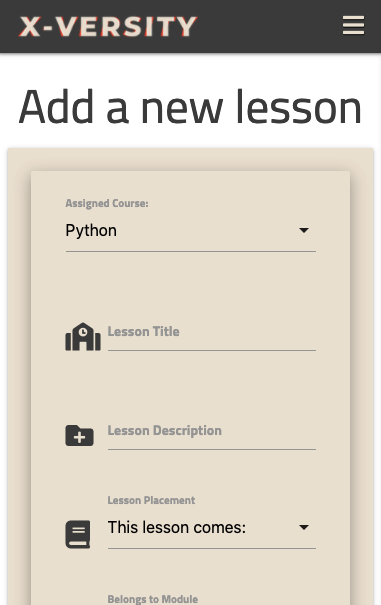</h1>
<h1 align="center">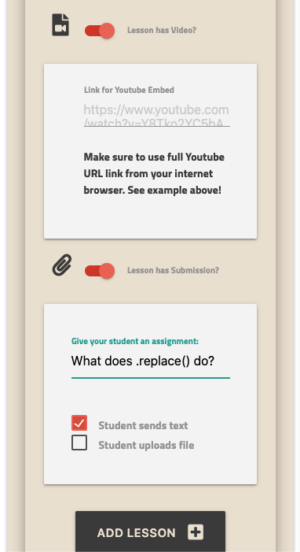</h1>

2) All submissions will end up here. 
<h1 align="center">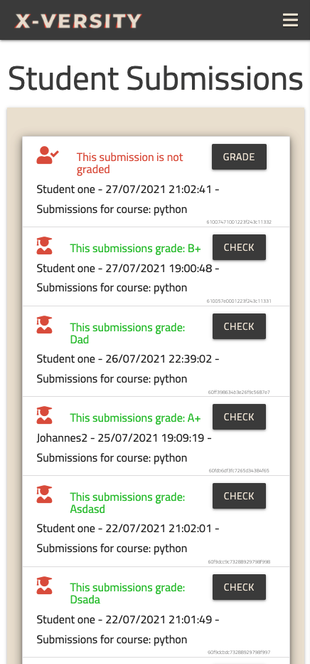</h1>
If it's a text submission, the teacher will read it like this. Otherwise a file would be opened up in a new browser tab. 
<h1 align="center">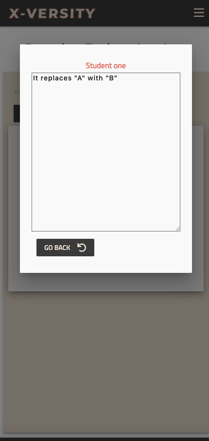</h1>

3) After viewing the submission, teacher sets grade, and adds feedback.
<h1 align="center">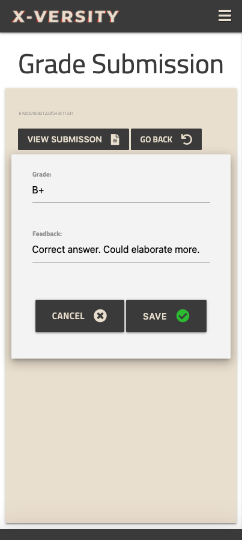</h1>

### 2. As as an admin:
```
1. I want to be able to add more courses. 

2. I want to be able to grant my users access. 

```
### Result: 

1) From here Admin can manage all existing courses, edit, delete or add. 
<h1 align="center">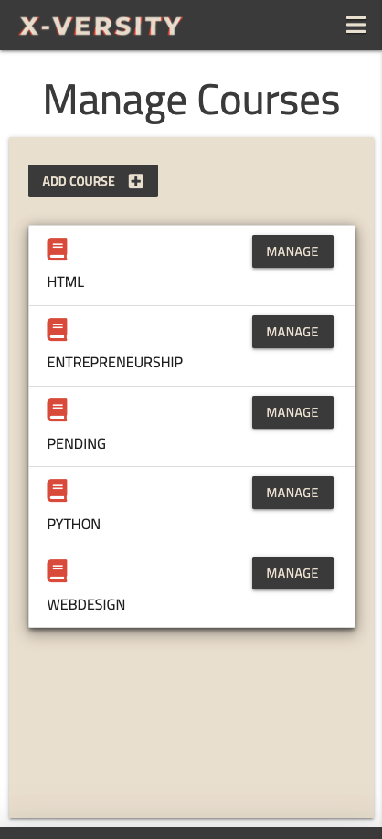</h1>
2) All users will end up here. 
<h1 align="center">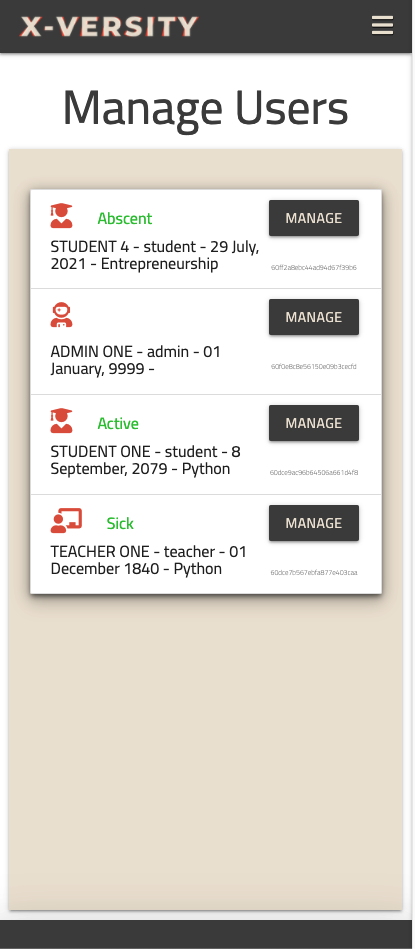</h1>
All users can be edited from here. Granting them access to courses, setting their roles and more. 
<h1 align="center">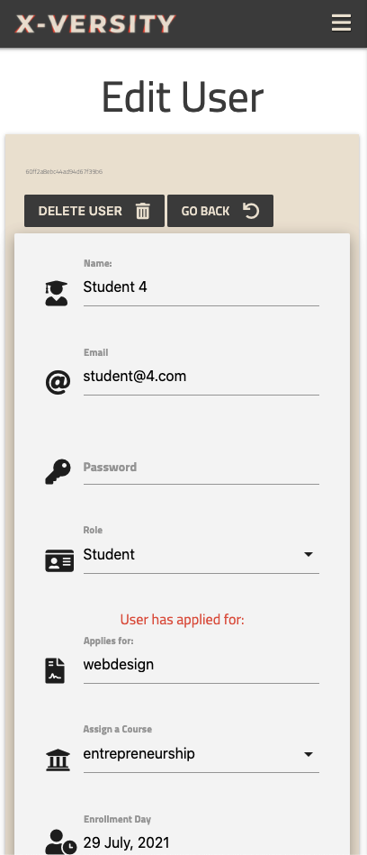</h1>

# Deployment
I used Heroku for the deployment of this app. 

### Steps for creating an app with Heroku.

1. Have all code ready. 
2. Import the required dependencies to requirements.txt file, so that Heroku knows whats needed to run the app.
3. Navigate to Dashboard in Heroku. 
4. Click "New" and select "Create new app" from the drop-down menu.
5. Provide a unique name for the app.
6. Select a region closest.
6. Then, "Create App".

### Setting up Heroku App

1. Navigate to "Settings". Deploying to Heroku you need to set up the config vars with the correct details to the database and repository:


### App Deployment.

1. Go to dashboard, then look for Deploy.
2. Scroll down to "Deployment Method" and select "GitHub".
3. Pick the Github repository to connect with.
4. Pick automatic deployment from the master branch. 

## Forking
To fork this repository or in other words to contribute without affecting the main branch, follow the steps below.
1. Sign in to **Github** or sign up.
2. Press this <a href="https://github.com/dadevfa/x-versity">GitHub Repository</a>
3. On the right hand side of the repository page you will see options for **watch**, **star**, and **fork**. Click **Fork**.
4. This will create a copy in your new repository which can be edited. After changes have been made you can select a **new pull request** located in the **original repository** just above the **file listing**.

## Cloning 
You want to clone this repository or maybe download it to a local device then follow the steps.
1. Sign in to **Github**.
2. Press this <a href="https://github.com/dadevfa/x-versity">GitHub Repository</a>
3. Look for the **"Code"** button just under the repository name.
4. To clone the repository using **HTTPS** click the link under **"Clone with HTTPS"**.
5. Open a terminal and change the **current working directory** to the location where you want the cloned version of the directory to be copied to.
6. Type **"git clone"** and paste the **HTTPS** code you copied.
7. Press **"enter"** to finish creating your clone.

# Credits
* Stackoverflow community. 
* Code Institute Slack community
* Code Institute for the start template with presets and plugins in Gitpod.
* Code Institute Student Support 
* Cloudinary for allowing PDFs to be uploaded.
* My mentor.